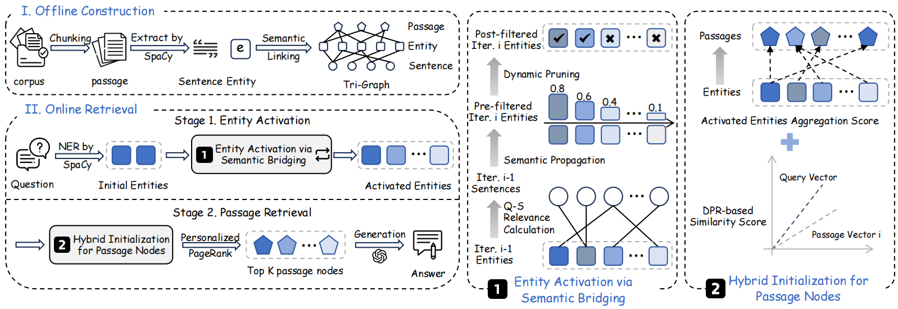
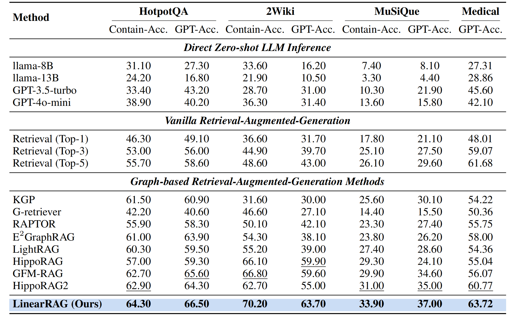
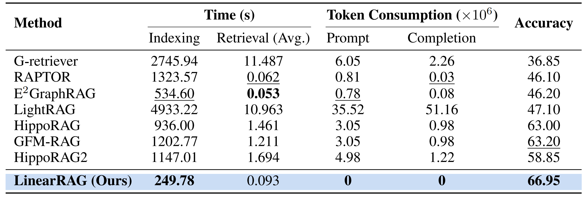

# **LinearRAG: Linear Graph Retrieval-Augmented Generation on Large-scale Corpora**

> A relation-free graph construction method for efficient GraphRAG. It eliminates LLM token costs during graph construction, making GraphRAG faster and more efficient than ever.

<p align="center">
  <a href="https://arxiv.org/abs/2510.10114" target="_blank">
    
  </a>
  <a href="https://huggingface.co/datasets/Zly0523/linear-rag/tree/main" target="_blank">
    
  </a>
  <a href="https://github.com/LuyaoZhuang/linear-rag" target="_blank">
    
  </a>
</p>

---

## 🚀 **Highlights**

- ✅ **Context-Preserving**: Relation-free graph construction, relying on lightweight entity recognition and semantic linking to achieve comprehensive contextual comprehension.
- ✅ **Complex Reasoning**: Enables deep retrieval via semantic bridging, achieving multi-hop reasoning in a single retrieval pass without requiring explicit relational graphs.
- ✅ **High Scalability**: Zero LLM token consumption, faster processing speed, and linear time/space complexity.

<p align="center">
  
</p>

---

## 🎉 **News**

- **[2025-10-27]** We release **[LinearRAG](https://github.com/DEEP-PolyU/LinearRAG)**, a relation-free graph construction method for efficient GraphRAG.
- **[2025-06-06]** We release **[GraphRAG-Bench](https://github.com/GraphRAG-Bench/GraphRAG-Benchmark.git)**, the benchmark for evaluating GraphRAG models.
- **[2025-01-21]** We release the **[GraphRAG survey](https://github.com/DEEP-PolyU/Awesome-GraphRAG)**.

---

## 🛠️ **Usage**

### 1️⃣ Install Dependencies

**Step 1: Install Python packages**

```bash
pip install -r requirements.txt
```

**Step 2: Download Spacy language model**

```bash
python -m spacy download en_core_web_trf
```

> **Note:** For the `medical` dataset, you need to install the scientific/biomedical Spacy model:

```bash
pip install https://s3-us-west-2.amazonaws.com/ai2-s2-scispacy/releases/v0.5.3/en_core_sci_scibert-0.5.3.tar.gz
```

**Step 3: Set up your OpenAI API key**

```bash
export OPENAI_API_KEY="your-api-key-here"
export OPENAI_BASE_URL="your-base-url-here"
```

**Step 4: Download Datasets**

Download the datasets from HuggingFace and place them in the `dataset/` folder:

```bash
git clone https://huggingface.co/datasets/Zly0523/linear-rag
cp -r linear-rag/dataset/* dataset/
```

**Step 5: Prepare Embedding Model**

Make sure the embedding model is available at:

```
model/all-mpnet-base-v2/
```

### 2️⃣ Quick Start Example

```bash
SPACY_MODEL="en_core_web_trf"
EMBEDDING_MODEL="model/all-mpnet-base-v2"
DATASET_NAME="2wikimultihop"
LLM_MODEL="gpt-4o-mini"
MAX_WORKERS=16

python run.py \
    --spacy_model ${SPACY_MODEL} \
    --embedding_model ${EMBEDDING_MODEL} \
    --dataset_name ${DATASET_NAME} \
    --llm_model ${LLM_MODEL} \
    --max_workers ${MAX_WORKERS}
```

### 3️⃣ FastAPI 服务

启动服务（默认 8000 端口）：

```bash
uvicorn src.api_server:app --host 0.0.0.0 --port 8000
```

示例请求：

- 索引构建：

```bash
curl -X POST http://localhost:8000/index \
  -H "Content-Type: application/json" \
  -d '{
    "dataset_name": "medical",
    "embedding_model": "model/all-mpnet-base-v2",
    "spacy_model": "en_core_web_trf",
    "working_dir": "./import"
  }'
```

- 问答（需先完成索引）：

```bash
curl -X POST http://localhost:8000/qa \
  -H "Content-Type: application/json" \
  -d '{
    "dataset_name": "medical",
    "questions": [
      {"question": "Who discovered X?", "answer": "Example answer"}
    ]
  }'
```

- 评测（基于预测结果路径）：

```bash
curl -X POST http://localhost:8000/evaluate \
  -H "Content-Type: application/json" \
  -d '{
    "dataset_name": "medical",
    "predictions_path": "results/medical/<timestamp>/predictions.json"
  }'
```

> 提醒：需要提前设置 `OPENAI_API_KEY`（可选 `OPENAI_BASE_URL`），并确保 SentenceTransformer 与 spaCy 模型已下载到对应目录。

#### MinerU 文档解析

```bash
export MINERU_BASE_URL="http://127.0.0.1:8000"   # 可选，默认即此地址
export MINERU_FILE_PARSE_PATH="/file_parse"       # 可选，默认即此路径

curl -X POST http://localhost:8000/mineru/parse \
  -H "Content-Type: application/json" \
  -d '{
    "file_path": "data/example.pdf",
    "backend": "pipeline",
    "parse_method": "pipeline",
    "return_md": true,
    "return_images": true
  }'
```

返回将包含 MinerU 调用状态及落盘路径。默认输出目录 `results/mineru/<文件名>/<timestamp>/`，可通过请求体 `output_dir` 覆盖。
若 MinerU 与 FastAPI 不同端口（FastAPI 默认 8000，MinerU 也常用 8000），需将 `MINERU_BASE_URL` 设置为 MinerU 实际地址或调整 FastAPI 端口，否则可能收到 `detail: Not Found`；若 MinerU 暴露的路径不同，可通过 `MINERU_FILE_PARSE_PATH` 修改。

#### 思维导图生成

根据 MinerU 生成的 Markdown 结构化为树状 JSON（根节点为文件名，节点包含 `id/level/title/content/order`）。

```bash
curl -X POST http://localhost:8000/mindmap \
  -H "Content-Type: application/json" \
  -d '{
    "doc_name": "sustainability-16-02641-v2"
  }'
```

服务会在 `output/mineru/<doc_name>/` 下选取时间戳目录名最大的记录，读取 `<doc_name>/<doc_name>.md`，并返回思维导图树。

#### content_list 转 chunk

将 MinerU 的 `_content_list.json` 转为标准分块文件 `data/<doc_name>/chunk.json`。

```bash
curl -X POST http://localhost:8000/content/chunk \
  -H "Content-Type: application/json" \
  -d '{
    "doc_name": "sustainability-16-02641-v2"
  }'
```

服务会在 `output/mineru/<doc_name>/` 下选取时间戳目录名最大的目录，读取 `<doc_name>_content_list.json`，按配置的 `chunk_token_size` 与 `chunk_overlap_token_size` 生成分块并写入 `data/<doc_name>/chunk.json`。

#### Markdown 转 chunk

将 MinerU 生成的 Markdown 直接分块写入 `data/<doc_name>/chunk.json`。

```bash
curl -X POST http://localhost:8000/markdown/chunk \
  -H "Content-Type: application/json" \
  -d '{
    "doc_name": "2021年点云姿态估计"
  }'
```

服务会在 `output/mineru/<doc_name>/` 下选取时间戳目录名最大的目录，读取 `<doc_name>/<doc_name>.md`，按配置的 `chunk_token_size` 与 `chunk_overlap_token_size` 空格分词生成分块。

## 🎯 **Performance**

<div align="center">


**Main results of end-to-end performance**

</div>
<div align="center">



**Efficiency and performance comparison.**

</div>

## 📖 Citation

If you find this work helpful, please consider citing us:

```bibtex
@article{zhuang2025linearrag,
  title={LinearRAG: Linear Graph Retrieval Augmented Generation on Large-scale Corpora},
  author={Zhuang, Luyao and Chen, Shengyuan and Xiao, Yilin and Zhou, Huachi and Zhang, Yujing and Chen, Hao and Zhang, Qinggang and Huang, Xiao},
  journal={arXiv preprint arXiv:2510.10114},
  year={2025}
}
```

This project is licensed under the GNU General Public License v3.0 ([License](LICENSE.TXT)).

## 📬 Contact

✉️ Email: zhuangluyao523@gmail.com
